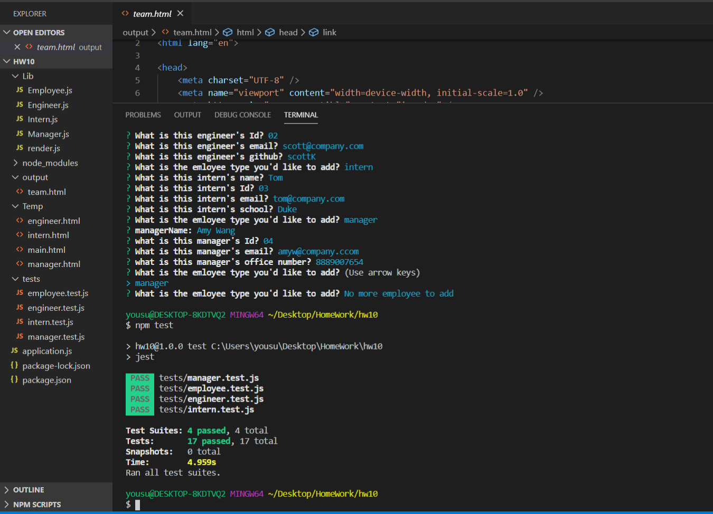
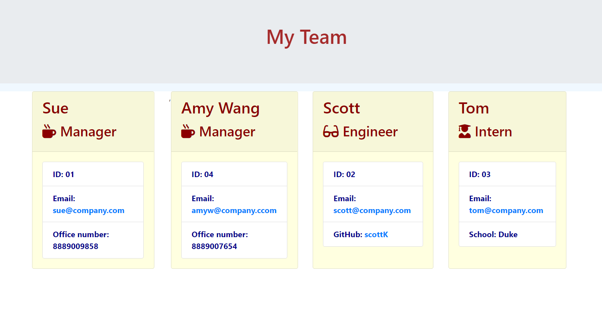

#                                       Team-profile-builder
####              Using command-line application to add team member to the team

This is a team member generating app. It uses command-line to enter different types of emaployees then generate a front page to show everybody in the team. 

__The installation steps include:__
* npm init
* npm install jest
* npm install inquirer

__There are 4 constructed classes for different types of employees and 4 unit tests to make sure each employee has all the information required.__

_Please chceck the screenshot below to get the idea of comman-line input and testing procedure, as wells as the generated front page:_

